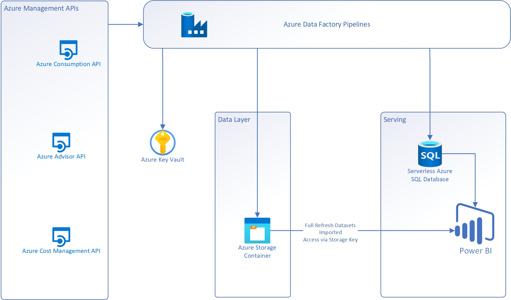

# Project

Welcome to the Cloud Financial Management Pipeline.

This project is a big data pipeline that is part of the Cloud Financial Management enterprise solution.

The key capabilities include:

* Ingest data from multiple sources
* Process and inrich the data
* Long-term data store

-------------------------------

# Overview
This project has been initiated to enable Enterprise Customers to get detailed insights in to their Azure Consumption (Usage) by leveraging the publicly accessible APIs. Cost Management is one of the Five Disciplines of Cloud Governance within the Cloud Adoption Framework. For many customers, governing cost is a major concern when adopting cloud technologies. Balancing performance demands, adoption pacing, and cloud services costs can be challenging. This is especially relevant during major business transformations that implement cloud technologies. For more information on cloud governance strategy please see - https://docs.microsoft.com/en-us/azure/cloud-adoption-framework/govern/.

As part of this project customers will be able to visualise the following -

*   Cost by Region
*   Cost by Category (Cost by Account, Cost by Meter Name (Service Name), Monthly Cost by Meter Category)
*   Cost by Subscription(s)
*   Cost by Account
*   Cost by Resource Group
*   Meter Category
*   Reservation Recommendations for all applicable services (Shared 30/60 days and Single 30/60 days)
*   Reservation Usage
*   Azure Advisor (Cost, Performance, Security, High Availability and Operational Excellence)

# Features coming soon
*   Azure Hybrid Use Benefit (AHUB) usage and advisor allocation
*   Cost by Tag(s)
*   Unallocated Resources

# Prerequisites
To enable the deployment of this solution the following prerequisites are required:

*   The Enrollment ID (Requires EA Admin rights) - https://ea.azure.com/
*   Global admin rights (for granting permissions to the root management group)
*   A Service Principal (SPN) created with Reader Access across all subscription(s) - https://docs.microsoft.com/en-us/azure/active-directory/develop/howto-create-service-principal-portal
*   Download and Install Azure Storage Explorer - https://storageexplorer.com/
*   Management Group Structure Defined
*   PowerBI Desktop

# The following will be deployed using the automated process provided
*   An Azure Data Factory that will make all the necessary API calls to the Consumption API & Cost Exports API to gather the required data for your Enrollment and Subscription(s).
*   A Serverless Azure SQL Database
*   A Storage Account for storing all the resultant output files generated by the Consumption API/Cost Exports API calls.
*   A Key Vault for storing various secrets and configuration items required

## Contributing

This project welcomes contributions and suggestions.  Most contributions require you to agree to a
Contributor License Agreement (CLA) declaring that you have the right to, and actually do, grant us
the rights to use your contribution. For details, visit https://cla.opensource.microsoft.com.

When you submit a pull request, a CLA bot will automatically determine whether you need to provide
a CLA and decorate the PR appropriately (e.g., status check, comment). Simply follow the instructions
provided by the bot. You will only need to do this once across all repos using our CLA.

This project has adopted the [Microsoft Open Source Code of Conduct](https://opensource.microsoft.com/codeofconduct/).
For more information see the [Code of Conduct FAQ](https://opensource.microsoft.com/codeofconduct/faq/) or
contact [opencode@microsoft.com](mailto:opencode@microsoft.com) with any additional questions or comments.

## Trademarks

This project may contain trademarks or logos for projects, products, or services. Authorized use of Microsoft
trademarks or logos is subject to and must follow
[Microsoft's Trademark & Brand Guidelines](https://www.microsoft.com/en-us/legal/intellectualproperty/trademarks/usage/general).
Use of Microsoft trademarks or logos in modified versions of this project must not cause confusion or imply Microsoft sponsorship.
Any use of third-party trademarks or logos are subject to those third-party's policies.
