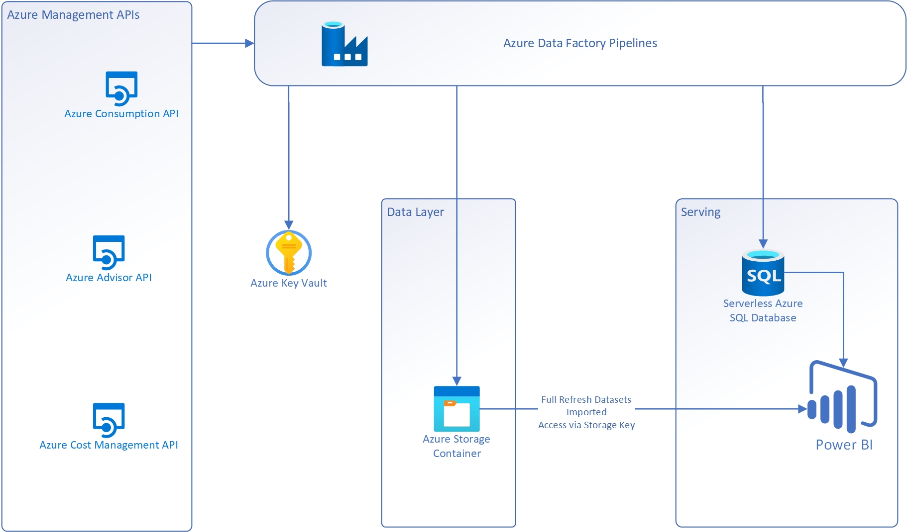

[Back](./readme.md)

# Architecture Overview

## Components
*   An Azure Data Factory that will make all the necessary API calls to the Consumption API & Cost Exports API to gather the required data for your Enrollment and Subscription(s).
*   An Azure SQL Server - A logical server that acts as an administrative endpoint for SQL databases
*   An Azure SQL Database (Serverless)
*   An Azure Storage Account for storing all the resultant output files generated by the Consumption API/Cost Exports API calls.
*   An Azure Key Vault for storing various secrets and configuration items required
*   A Power BI Report Template with a set of starter reports.

## Component Details

### Data Factory

#### Pipelines

##### RefreshAllData_ExistingExports
Use this pipeline when Cost Management Exports for ActualCost and AmortizedCost were created at deployment time.

This pipeline should be triggered after the exports have run. i.e. if the exports are scheduled to run at 10am, then run this pipeline after 11am.
If the Usage files dont exist, the usage data load will fail.

This pipeline executes the individual pipelines responsible for obtaining and storing the cost optimizatipon datasets

###### Parameters
* FullRefreshStartDate - Earliest date for data extraction.  Used by datasets defined as Full refresh datasets (see below)
* aubi_StorageContainerName - Azure storage Container name where all files will be stored.
* aubi_StorageDirectoryName - Base Directory underwhich all data will be stored.  Subdirectories will be defined by the individual pipelines
* AdvisorGenerationWaitSecs - Length of time to wait between triggering the generation of advisor recommendations and getting the recommendations.
* CostManagementExportsAPIVersion - Cost Management Exports API version
* ConsumptionAPIVersion - Consumption API Version
* AdvisorAPIVersionGenerateRecs - Azure Advisor Generate Recommendations API Version
* AdvisorAPIVersionGetRecs - Azure Advisor Get Recommendations API Version
* CostMangementReservationDetailsAPIVersion - Cost Management Reservation Details API Version
* UsageExportDirectory - Directory where usage exports can be found.

Many of the APIs called rely on being called with a start and end date for the data to be returned. The data loading strategy for these datasets is outlined below:

|Dataset|Pipeline|API|Refresh Type|Notes|
---|---|---|---|---|
|Advisor Recommendations|GetAdvisorData|Microsoft.Advisor/generateRecommendations|Full|Generates recommendations for all subscriptions|
|Instance Size Flexibility Ratios |ISFRatio|https://isfratio.blob.core.windows.net/isfratio/ISFRatio.csv|Full|Downloads publicly available csv file|
|Marketplace purchases|GetMarketplaceData|Microsoft.Consumption/marketplaces|Full|Data extracted from "FullRefreshStartDate" up to current date|
|Price sheet|GetPriceSheet|Microsoft.Consumption/pricesheets|Full|No date range needed|
|Reservation Details|GetReservationDetailsOrchestrator|Microsoft.CostManagement/generateReservationDetailsReport|Full|Data extracted from "FullRefreshStartDate" up to current date.  The API is limited to a maximum date range of 3 months so the full data range will be broken down into 3 month intervals|
|Reservation Recommendations|GetReservationRecomendations|Microsoft.Consumption/reservationRecommendations|Full|No date range needed|
|Reservation Transactions|GetReservationTransactions|Microsoft.Consumption/reservationTransactions|Full|Data extracted from "FullRefreshStartDate" up to current date|
|Usage Data|ProcessInboundUsageData|N/A - Picks up usage files generated by existing Cost Management Exports|Incremental|Cost Management Export files are written to folders with the naming convention 20220201-20220228.  The incremental load reads these dates, deletes database records that match these dates, then loads the current month to date file|

In portal, Exports can be configured as:

- Daily Export Mont-to-date
- Weekly export of last 7 days
- Monthly export of last month's cost

The pipeline kicks off daily and looks for any files that were exported. It then gets the latest file and imports that data range of data.

### Azure SQL Server

The Azure SQL Server provides some management and security features for the reporting database.  In particular, the SQL Server defines:

An Administrative Azure Active Directory user (or group)
A Data encryption policy (defaults to encryption enabled with a Service managed key)
Firewalls and virtual network access controls - Firewall rules and VNet access must be configured based on requirement.
https://docs.microsoft.com/en-gb/azure/azure-sql/database/network-access-controls-overview

Database Backup and backup retention policies can also be configured at the server level.

### Azure SQL Database

The Azure SQL Database stores a number of data assets used by the Cost Optimization report.
The performance level of the database can be configured in the "Compute and Storage" settings blade.
https://docs.microsoft.com/en-gb/azure/azure-sql/database/purchasing-models

By default, a serverless SQL Database is deployed:
https://docs.microsoft.com/en-gb/azure/azure-sql/database/serverless-tier-overview

#### Tables

|Table Name|Description|Schema Notes|
---|---|---|
|ActualCost|Stores Actual Costs. https://docs.microsoft.com/en-us/azure/cost-management-billing/reservations/understand-reserved-instance-usage-ea#reservation-charges-in-azure-usage-data | Partitioned by month, clustered column store|
|ActualCostSummaryDate|An aggregated dataset based on Actual Cost||
|AmortizedCost|Stores Amortized Costs. https://docs.microsoft.com/en-us/azure/cost-management-billing/reservations/understand-reserved-instance-usage-ea#reservation-charges-in-azure-usage-data | Partitioned by month, clustered column store|
|AmortizedCostSummaryDate|An aggregated dataset based on Amortized Cost||
|ISFData|Instance Size Flexibility ratio data||
|ReservationDetails| Reservation Details data||

#### Views

|View Name|Description|
---|---|
|ActualCostSummaryView|Aggregated view of Actual Costs. https://docs.microsoft.com/en-us/azure/cost-management-billing/reservations/understand-reserved-instance-usage-ea#reservation-charges-in-azure-usage-data |
|RegionSummaryDate|An aggregated dataset based on Actual Cost|

#### Stored Procedures

|Procedure Name | Description|
---|---|
|addMonthPartitions|Maintenance procedure executed at the start of daily processing.  Ensures that 24 future monthly partitions exist.  This reduces the risk that partitions will need to be split (data intensive operation) |
|DeleteActualCostDataForDateRange|Deletes data from the ActualCost table for a given date range|
|DeleteAmortizedCostDataForDateRange|Deletes data from the AmortizedCost table for a given date range|
|Reorganize<xxx>Index|Maintenance procedure executed by the daily process. Reorganises index structures|
