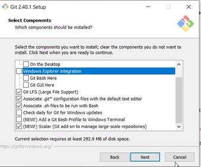
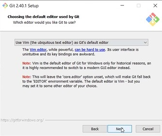
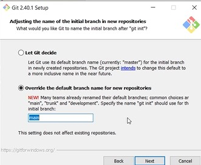
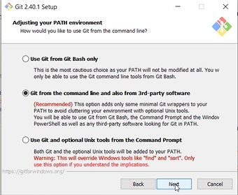
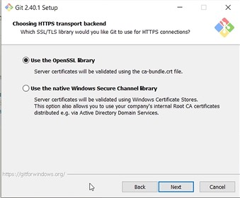
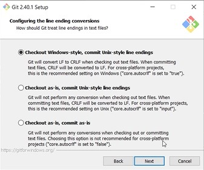
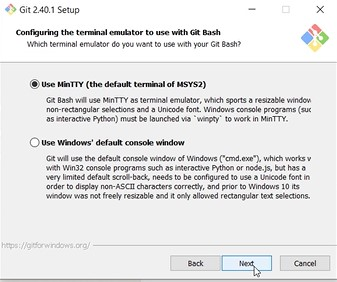
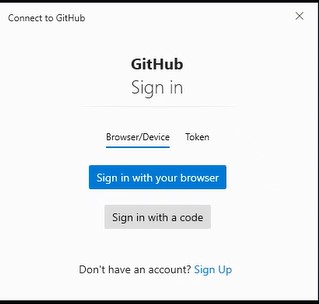

# Developer Docs

* [GitHub Connect with SSH](#github-connect-with-ssh)
* [Development Setup](#development-setup)
* [Testing Your Code](#testing-your-code)
* [Deployment Tips](#deployment-tips)
    * [Catching up with Reality](#catching-up-with-reality)
    * [Squashing Commits](#squashing-commits)
    * [Pull Request and Build](#pull-request-and-build)
* [Patch Deployments](#patch-deployments)
* [References](#references)

Follow the [Quick Start](../README.md#quick-start) to get the starting development environment.

# Install Git for Windows

Keep most defaults except:
* Don't include Explorer integration
* Use VIM as the editor
* Override default branch to `main`









# GitHub Connect with SSH

You need to create an ssh key on your laptop and associate with your github user account.

* Create Local ssh key
* Add new ssh key to your GitHub Account

## Create a local ssh key
https://docs.github.com/en/authentication/connecting-to-github-with-ssh

```bash
# Check if you have an ssh key
ls -al ~/.ssh

# Create
$ ssh-keygen -t ed25519 -C "your_email@example.com"

# Add key to ssh-agent
eval "$(ssh-agent -s)"
ssh-add ~/.ssh/id_ed25519

# Get Public value
cat ~/.ssh/id_ed25519.pub
```

## Add key to your GitHub Account

- Navigate to github.com
- Open your Profile -> Settings
- Navigate to SSH, Click add ssh key
- For Title add your email address and paste your key

Test your connection

```bash
ssh -T git@github.com

# or ssh over https
 ssh -T -p 443 git@ssh.github.com
```

## Troubleshoot

Organization networking teams may block ssh traffic even over https. Use Git Credential Manager to cache your Git Credentials.
 and use https to checkout th project.

```bash
# Attempt to interact with the remote repository to trigger auth.
git clone ...
```



# Development Setup

Setup your dev environment by

```bash
# Create and activate a python virtual environment
# virtualenv \path\to\.venv -p path\to\specific_version_python.exe
python -m venv .venv
# source .venv/bin/activate
.venv\scripts\activate
# deactivate

pip install -r requirements_dev.txt

# Install tools
sudo apt-get update
sudo apt-get install -y shellcheck jq unzip
pre-commit install

# Install azure cli
curl -sL https://aka.ms/InstallAzureCLIDeb | sudo bash

# login to azure cli
az login --tenant $TENANT_ID
```

# Testing Your Code

Ideally, all code is checked to verify the following:

- All the unit tests pass
- All code passes the checks from the linting tools

To run the linters, run the following commands:

```bash
# Manually with pre-commit scripts

#  pre-commit run --all-files apply_arm_exports
pre-commit run --all-files check_datafactory_arm_format
pre-commit run --all-files codespell
pre-commit run --all-files shellcheck
pre-commit run --all-files check_sqlfluff
pre-commit run --all-files mixed-line-ending

pre-commit run --all-files isort
pre-commit run --all-files black
pre-commit run --all-files flake8
pre-commit run --all-files pylint
pre-commit run --all-files bandit

# Run directly -------

# Update with latest Prod/Patch ADF changes
# Navigate to Azure Portal Prod/Patch ADF-> Manage -> Click Export Arm Template
# Update project with exported arm templates
./script/apply_arm_export /path/to/arm_template_export.zip

# Sort Templates
python ./script/format_json.py --file ".${PIPELINE_ADF_PATCH_TEMPLATE_PATH}/${PIPELINE_ADF_TEMPLATE_NAME}"
python ./script/format_json.py --file ".${PIPELINE_ADF_PATCH_TEMPLATE_PATH}/${PIPELINE_ADF_TEMPLATE_PARAMETER_NAME}" --parameters ".${PIPELINE_ADF_PATCH_TEMPLATE_PATH}/${PIPELINE_ADF_TEMPLATE_NAME}.found"

# Check for spelling errors
codespell

# Check for scripting errors
shellcheck $(find script/!(azcopy*|data_files*|*.py) -type f)
shellcheck $(find test/script/!(azcopy*|data_files*|*.py) -type f)

# Check for SQL Errors
sqlfluff lint **/*.sql

# Check for window line endings
find **/ -not -type d -exec file "{}" ";" | grep CRLF
# Fix with any issues with:
# sed -i.bak 's/\r$//' ./path/to/file.sql
# Or Remove them
# find . -name "*.Identifier" -exec rm "{}" \;

# Check python scripts
isort --skip .venv ./script/
black ./script/*.py
flake8 ./script/*.py
pylint ./script/*.py
bandit ./script/*.py
```

# Deployment Tips

## Catching up with Reality

If it's taking a while to develop your new feature, and you want to catch up with what's in the current main branch, you can use git rebase. This will pull the latest changes locally, rewind your commits, bring in the latest changes from main, and replay all of your commits on top.

<div style="padding: 15px; border: 1px solid transparent; border-color: transparent; margin-bottom: 20px; border-radius: 4px; color: #31708f; background-color: #d9edf7; border-color: #bce8f1;">
<b>Tip:</b> If you use the workflow below, it is important that you force push the update as described. Git might prompt you to do git pull first. Do <strong>NOT</strong> do that! It would mess up your commit history.
</div>

```bash
# Run this from your feature branch
git fetch origin main  # to pull the latest changes into a local main branch
git rebase origin/main # to put those changes into your feature branch before your changes
```

If rebase detects conflicts, repeat this process until all changes have been resolved:

1. git status shows you the file with the conflict; edit the file and resolve the lines between `<<<< | >>>>`
2. Add the modified file: `git add <file>` or `git add .`
3. Continue rebase: `git rebase --continue`
4. Repeat until you've resolved all conflicts

After rebasing your branch, you will have rewritten history relative to your branch. When you go to push you will see an error that your history has diverged from the original branch. In order to get your branch up-to-date with your local branch, you will need to force push, using the following command:

```bash
# Run this from your feature branch
git push origin --force-with-lease
```

If that command fails, it means that new work was pushed to the branch from either you or another contributor since your last rebase. You will have to start over the git fetch and rebase process described above, or if you are really confident those changes are not needed, just overwrite them:

```bash
# Run this from your feature branch, overwriting any changes in the remote branch
git push origin --force
```

## Squashing Commits
It’s possible to take a series of commits and squash them down into a single commit with the interactive rebasing tool. The script puts helpful instructions in the rebase message:

Get the commit id you'd like to squash back to:
```bash
# Find the commit id
git log

# Start the rebasing
git rebase -i <commit-id>

# Use VS Code to edit
GIT_EDITOR="code --wait" git rebase -i <commit-id>
```

Running this command gives you a list of commits in your text editor that looks something like this:

```bash
pick f7f3f6d Change my name a bit
pick 310154e Update README formatting and add blame
pick a5f4a0d Add cat-file
```

It’s important to note that these commits are listed in the opposite order than you normally see them using the log command.

Specify “squash”, Git applies both that change and the change directly before it and makes you merge the commit messages together. So, if you want to make a single commit from these three commits, you make the script look like this:

```bash
pick f7f3f6d Change my name a bit
squash 310154e Update README formatting and add blame
squash a5f4a0d Add cat-file
```

When you save and exit the editor, Git applies all three changes and then puts you back into the editor to merge the three commit messages:

```bash
# This is a combination of 3 commits.
# The first commit's message is:
Change my name a bit

# This is the 2nd commit message:

Update README formatting and add blame

# This is the 3rd commit message:

Add cat-file
```

After squashing your commits, you will have rewritten history relative to your branch. When you go to push you will see an error that your history has diverged from the original branch. In order to get your branch up-to-date with your local branch, you will need to force push, using the following command:

```bash
# Run this from your feature branch
git push origin --force-with-lease
```

If that command fails, it means that new work was pushed to the branch from either you or another contributor since your last rebase. You will have to start over the git fetch and rebase process described above, or if you are really confident those changes are not needed, just overwrite them:

```bash
# Run this from your feature branch, overwriting any changes in the remote branch
git push origin --force
```

## Pull Request and Build

After all changes have been committed,

* Finalize and commit all changes,
* Check if you need to catch up with reality
* Collapse Changes into one commit
* Create a pull request

Once the pull request has been accepted,

* Merge the changes into the `main` branch.
* Build the assets
* Create a release

## Update ADF Code from Exported Arm
Update the git repository with changes made on the Portal.

* Navigate to the Data Factory Manage Tab
* Select the ARM template and click Export Arm Template
* run the command `./script/apply_arm_export /path/to/exported_arm_template.zip`

## Patch Deployments

See [Patch Deployments](patch_release.md)

## Pull Request Reviews

Review all PRs and check for:

- Code quality
    - Consistent Style
    - No commented code
    - New lines for end of files
    - Consistent Header comments for scripts
- Code Organization. Folder structure etc
- No secrets uploaded

# References
* Get started with AzCopy https://learn.microsoft.com/en-us/azure/storage/common/storage-use-azcopy-v10
* See https://learn.microsoft.com/en-us/azure/data-factory/tutorial-bulk-copy-portal
* Install azure cli https://learn.microsoft.com/en-us/cli/azure/install-azure-cli-linux?pivots=apt

[simon]: https://www.simonholywell.com/?utm_source=sqlstyle.guide&utm_medium=link&utm_campaign=md-document
    "SimonHolywell.com"
[celko]: https://www.amazon.com/gp/product/0120887975/
    "Joe Celko's SQL Programming Style (The Morgan Kaufmann Series in Data Management Systems)"
[iso-8601]: https://en.wikipedia.org/wiki/ISO_8601
    "Wikipedia: ISO 8601"
[reserved-keywords]: https://learn.microsoft.com/en-us/sql/t-sql/language-elements/reserved-keywords-transact-sql?view=sql-server-ver16
    "SQL Server Reserved Keywords"
[rivers]: https://practicaltypography.com/one-space-between-sentences.html
    "Practical Typography: one space between sentences"
